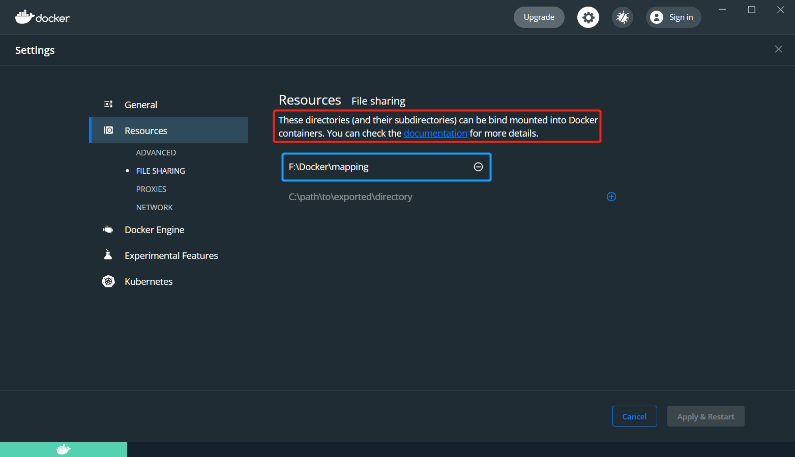

# Docker文件映射问题（Win10环境）

---

执行的命令：

```shell
docker run -itd --name redis-master -p 6379:6379 -v /F/Docker/mapping/redis/redis.conf:/usr/local/bin/redis.conf redis
```

异常信息：

```
docker: Error response from daemon: status code not OK but 500: ����FDocker.Core, Version=3.3.1.63119, Culture=neutral, PublicKeyToken=nullocker.Core.DockerException        ClassNameMessageDataInnerExceptionHelpURLStackTraceStringRemoteStackTraceStringRemWatsonBucketsSystem.Collections.IDictionarySystem.Exceptiocker.Core.DockerExceptionFilesharing has been cancelled


�   在 Docker.ApiServices.Mounting.FileSharing.<DoShareAsync>d__7.MoveNext() 位置 C:\workspaces\PR-15633\src\github.com\docker\pinata\win\src\Docker.ApiServices\Mounting\FileSharing.cs:行号 0
--- 引发异常的上一位置中堆栈跟踪的末尾 ---
   在 System.Runtime.ExceptionServices.ExceptionDispatchInfo.Throw()
   在 System.Runtime.CompilerServices.TaskAwaiter.HandleNonSuccessAndDebuggerNotification(Task task)
   在 Docker.ApiServices.Mounting.FileSharing.<ShareAsync>d__5.MoveNext() 位置 C:\workspaces\PR-15633\src\github.com\docker\pinata\win\src\Docker.ApiServices\Mounting\FileSharing.cs:行号 53
--- 引发异常的上一位置中堆栈跟踪的末尾 ---
   在 System.Runtime.ExceptionServices.ExceptionDispatchInfo.Throw()
   在 System.Runtime.CompilerServices.TaskAwaiter.HandleNonSuccessAndDebuggerNotification(Task task)
   在 Docker.HttpApi.Controllers.FilesharingController.<ShareDirectory>d__2.MoveNext() 位置 C:\workspaces\PR-15633\src\github.com\docker\pinata\win\src\Docker.HttpApi\Controllers\FilesharingController.cs:行号 21
--- 引发异常的上一位置中堆栈跟踪的末尾 ---
   在 System.Runtime.ExceptionServices.ExceptionDispatchInfo.Throw()
   在 System.Runtime.CompilerServices.TaskAwaiter.HandleNonSuccessAndDebuggerNotification(Task task)
   在 System.Threading.Tasks.TaskHelpersExtensions.<CastToObject>d__1`1.MoveNext()
--- 引发异常的上一位置中堆栈跟踪的末尾 ---
   在 System.Runtime.ExceptionServices.ExceptionDispatchInfo.Throw()
   在 System.Runtime.CompilerServices.TaskAwaiter.HandleNonSuccessAndDebuggerNotification(Task task)
   在 System.Web.Http.Controllers.ApiControllerActionInvoker.<InvokeActionAsyncCore>d__1.MoveNext()
--- 引发异常的上一位置中堆栈跟踪的末尾 ---
   在 System.Runtime.ExceptionServices.ExceptionDispatchInfo.Throw()
   在 System.Runtime.CompilerServices.TaskAwaiter.HandleNonSuccessAndDebuggerNotification(Task task)
   在 System.Web.Http.Controllers.ActionFilterResult.<ExecuteAsync>d__5.MoveNext()
--- 引发异常的上一位置中堆栈跟踪的末尾 ---
   在 System.Runtime.ExceptionServices.ExceptionDispatchInfo.Throw()
   在 System.Runtime.CompilerServices.TaskAwaiter.HandleNonSuccessAndDebuggerNotification(Task task)
   在 System.Web.Http.Dispatcher.HttpControllerDispatcher.<SendAsync>d__15.MoveNext()
�8
MoveNext
Docker.ApiServices, Version=3.3.1.63119, Culture=neutral, PublicKeyToken=null
Docker.ApiServices.Mounting.FileSharing+<DoShareAsync>d__7
Void MoveNext()�Docker.ApiServices.
See 'docker run --help'.
```

解决方法：

