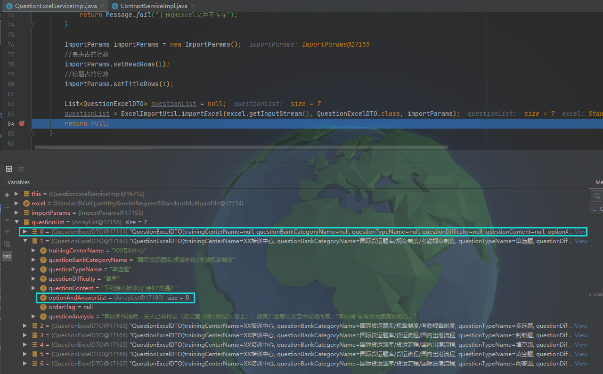
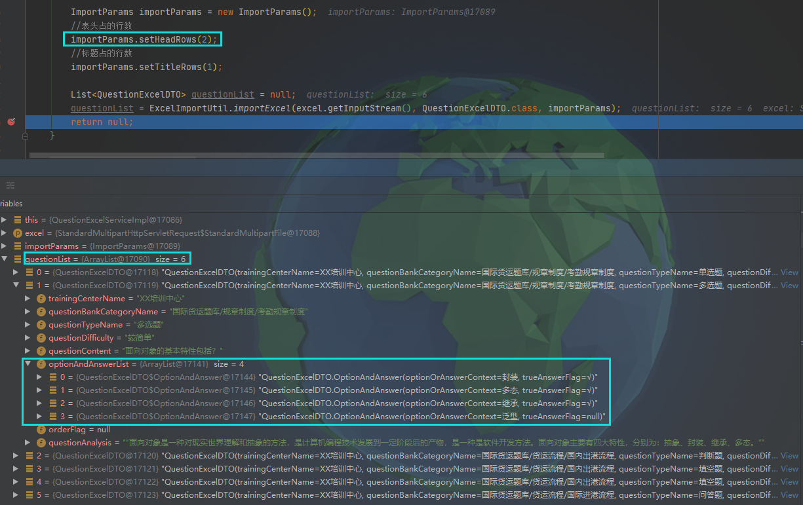

# EasyPio 一对多数据导入 null值问题

---

### 导入Excel格式


### 后端代码

1. 准备接收数据的实体类

```java
@Data
@NoArgsConstructor
@AllArgsConstructor
@ExcelTarget(value = "question")
public class QuestionExcelDTO implements Serializable {

    private static final long serialVersionUID = -548630840115528607L;

    /**
     * 培训中心名称
     */
    @Excel(name = "培训中心", needMerge = true, width = 20)
    private String trainingCenterName;

    /**
     * 题库分类名称
     */
    @Excel(name = "题库分类", needMerge = true, width = 35)
    private String questionBankCategoryName;

    /**
     * 题型名称
     */
    @Excel(name = "题型", needMerge = true)
    private String questionTypeName;

    /**
     * 题目难度
     */
    @Excel(name = "题目难度", needMerge = true)
    private String questionDifficulty;

    /**
     * 题目内容
     */
    @Excel(name = "题目内容", needMerge = true, width = 50)
    private String questionContent;

    /**
     * 选项/答案信息
     */
    @ExcelCollection(name = "选项/答案信息")
    List<OptionAndAnswer> optionAndAnswerList;

    /**
     * 答案是否依序(0：否 1：是)
     */
    @Excel(name = "答案依序", needMerge = true)
    private String orderFlag;

    /**
     * 试题解析
     */
    @Excel(name = "试题解析", needMerge = true, width = 40)
    private String questionAnalysis;

    @Data
    @NoArgsConstructor
    @AllArgsConstructor
    @ExcelTarget("optionAndAnswer")
    public static class OptionAndAnswer implements Serializable {
        private static final long serialVersionUID = 7597689935526024438L;

        /**
         * 选项活答案内容
         */
        @Excel(name = "选项/标准答案", width = 40)
        private String optionOrAnswerContext;

        /**
         * 该选项是否为正确答案（“0”：不是 “1”：是）
         */
        @Excel(name = "正确答案")
        private String trueAnswerFlag;
    }
}
```

2. 实现Excel数据导入的方法

```java
@Override
public Message importQuestion(MultipartFile excel) throws Exception {
    if (excel == null || excel.isEmpty()) {
        return Message.fail("上传的excel文件不存在");
    }

    ImportParams importParams = new ImportParams();
    importParams.setHeadRows(1);
    importParams.setTitleRows(1);

    List<QuestionExcelDTO> questionList = null;
    questionList = ExcelImportUtil.importExcel(excel.getInputStream(), QuestionExcelDTO.class, importParams);
    return null;
}
```

### 问题描述



从debug的结果看，存在的解析错误有两点：

    1. 导入的Excel表格中的实际数据只有6条，但代码错误的解析出了7条数据，且第一条数据的所有数值均为null；
       2. “一对多”数据中的“多”没有解析出来，全部为null。

### 问题解决

查看了EasyPio的官方文档以后发现，一切的问题出在源代码中的这条语句：

```java
// 指定表头所占的行数
importParams.setHeadRows(1);
```

再来看看刚才导入数据的Excel的表头：


可以看到表头的行数应该是2，但是我们设置成了1，将行数设置成2以后再次进行解析：



从解析结果看，问题应该已经得到了解决。