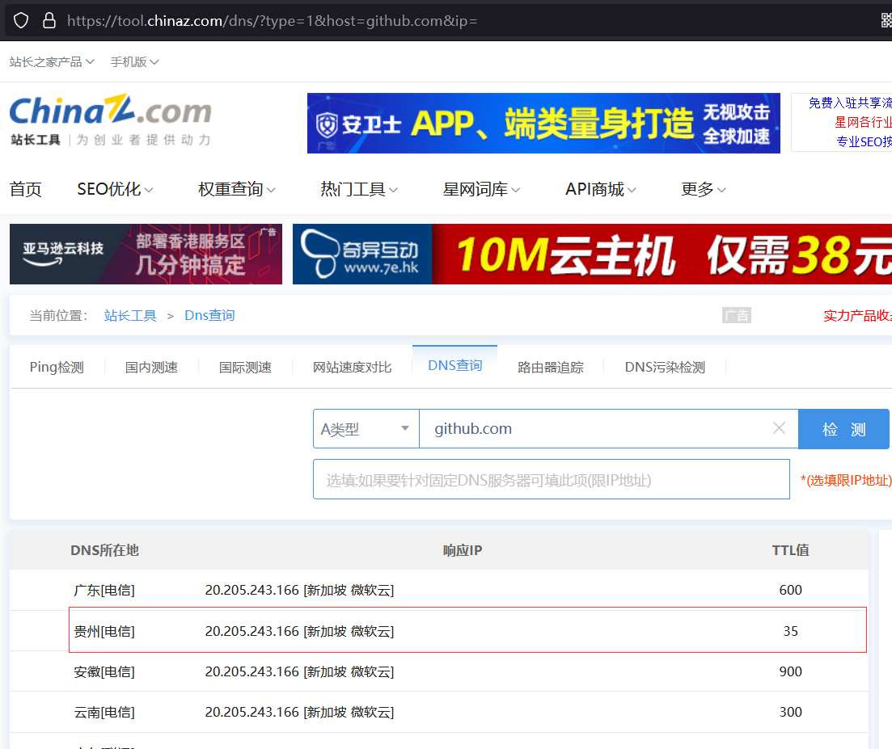

# Github 无法访问问题

[TOC]

## 方案一：手动修改 Host

1.   通过工具查询 github.com 的 DNS

     https://tool.chinaz.com/dns/?type=1&host=github.com&ip=

     

     

2.   选一个响应时间短的 IP，填写到 HOST

     

## 方案二：自动修改 Host

https://gitee.com/klmahuaw/GitHub520