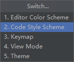
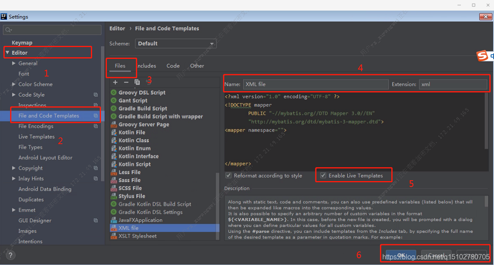

# IDEA好用的配置

### 1. 自动添加/删除依赖

FIle → Settings → Editor → General → AutoImport：


### 2.自动生成serialVersionUID


### 3. @author 、@date


```
/**
 * ${DESCRIPTION}
 *
 * @author xzy
 * @date ${DATE}${TIME}
 */
```


升级用法：

① 为不同的主题设置不同的模板


② 使用快捷键（Ctrl + `）快速切换模板



### 4. mybatis-mapper 创建模板



```xml
<?xml version="1.0" encoding="UTF-8"?>
<!DOCTYPE mapper PUBLIC "-//mybatis.org//DTD Mapper 3.0//EN"
        "http://mybatis.org/dtd/mybatis-3-mapper.dtd">
<mapper namespace = "">
 
</mapper>
```

