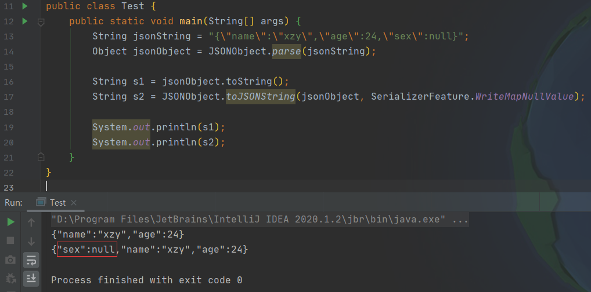

# Fastjson问题汇总

---

## 1. String -> JsonObject

### 1.1 丢失值为null的项目

待转换的Json字符串：

```json
{"name":"xzy","age":24,"sex":null}
```

Java代码：

```java
public class Test {
    public static void main(String[] args) {
        String jsonString = "{\"name\":\"xzy\",\"age\":24,\"sex\":null}";
        Object jsonObject = JSONObject.parse(jsonString);

        String s1 = jsonObject.toString();
        String s2 = JSONObject.toJSONString(jsonObject, SerializerFeature.WriteMapNullValue);

        System.out.println(s1);
        System.out.println(s2);
    }
}
```



## 2. JsonObject -> String

