### Java 进程 CPU 使用率 100% 问题排查

参考文章：https://zhuanlan.zhihu.com/p/363636221

>   在操作系统中，CPU 是稀缺的资源，为了应对 “僧多粥少” 的局面，操作系统通常会采用时间片轮转等策略将 CPU 的使用权分配给多个线程。线程获取到 “时间片” 以后就拥有了 CPU 一段时间的使用权限，如果在时间片内线程一直在使用 CPU，那么 CPU 的使用率就是 100%。通常情况下，CPU 的计算速度很快，除非是 CPU 密集型的任务，大多数任务都会在小于时间片的时间内处理完毕，即 CPU 使用率很少达到 100%。

Java 进程 CPU 使用率 100% 问题的排查步骤大体上是一样的，只是命令会稍有区别：

1.  找出 CPU 使用率最高的进程的 PID
2.  根据 PID 找出进程内 CPU 使用率最高的线程的线程号
3.  根据线程号找出对应的 Java 线程
4.  排除问题…

---

### 实战模拟

构造一个请求接口，模拟无限产生 Person 实例：

```java
@RestController
@RequestMapping("demo")
public class DemoController {
    
    @GetMapping("test")
    public boolean test(@RequestParam boolean justDo) {

        List<Person> persons = new ArrayList<>();
        
        int i = 1;
        if (justDo) {
            while (true) {
                persons.add(new Person("王五", i));
                System.out.println(persons.size());
            }
        }
        return justDo;
    }
}
```

调用接口，触发 CPU 使用率 100% 的问题。

问题排查过程：

1.  使用`top`命令找出 CPU 占用最高的进程。

    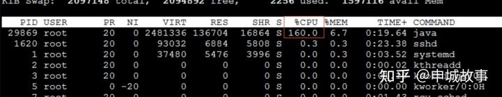

    

2.  使用`ps -ef | grep java`或者`jps`命令查看 CPU占用高的进程是否为 JAVA 进程。

    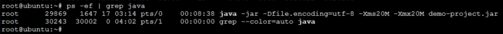

    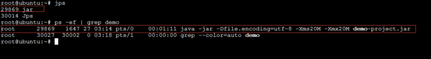

    

3.  使用`top -H -p pid`命令查询此<u>进程的所有线程</u>情况，发现主要有三个线程 (PID 为29871 29872 29873) 占用 CPU 高。

    >   -H 表示以线程的维度展示，默认以进程维度展示。

    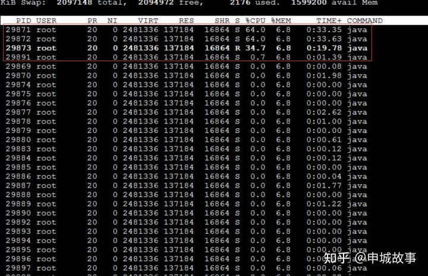

    

4.  使用命令`jstack pid > pid.tdump`将此<u>进程的线程栈</u>导出到文件并使用 `cat` 命令进行查看。pid.tdump 文件后缀名随意，通常以 tdump 结尾。

    

5.  将前一步骤查出的3个线程 PID 从十进制转为十六进制，因为 java 线程栈文件中的线程 id 是十六进制。对应分别为`29871 -> 0x74af，29872 -> 0x74b0，29873 -> 0x74b1`。

    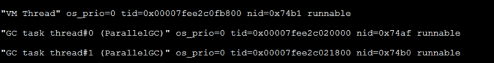

    发现此3个线程中有2个为 GC 线程和1个工作线程。GC 线程忙碌表示内存不够用了，要进行内存回收，可能是 JAVA 内存回收不了，导致一直 GC

    

6.  使用`jstat -gcutil pid`命令查看<u>进程的堆情况</u>，发现年轻代中 Eden（伊甸园）和 old 代已使用的占当前容量百分比很高，并且 GC 频繁。

    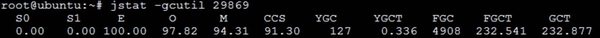

    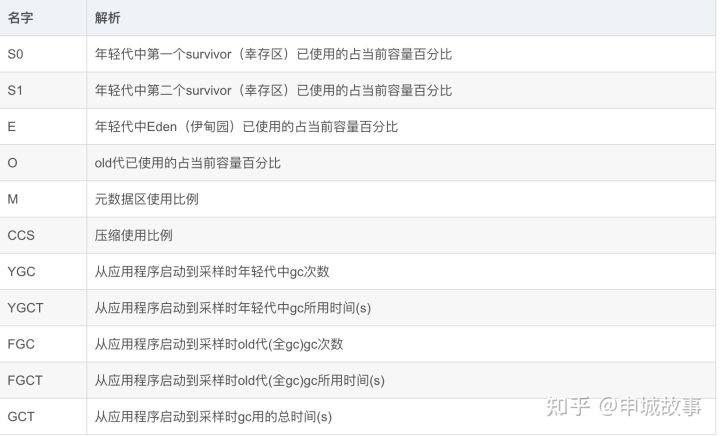

    

7.  使用`jmap -dump:live,format=b,file=pid.hprof pid`命令导出堆文件，只导出 live 的对象。文件后缀名可以是任意的，因为它也是二进制的，不过通常以 hprof 结尾。

    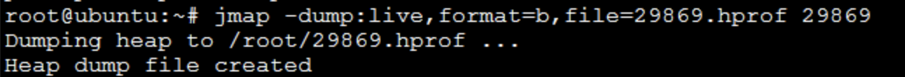

    

8.  使用`JAVA_HOME/bin/jvisualvm.exe`工具分析快照。

    载入快照：文件→载入→文件类型（堆）

    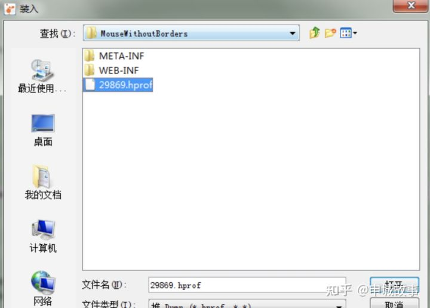

    选择类列表，按照大小排序，找出占用内存最大的类别，发现是 Person 类：

    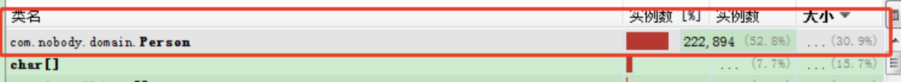

    至此，问题找到原因，原来是在死循环中，不断生产 Person 实例，并且无法回收，不仅工作线程一直占用 CPU，而且导致 GC 线程忙碌进行回收内存，但是回收不了，最后导致内存不足`java.lang.OutOfMemoryError`。

    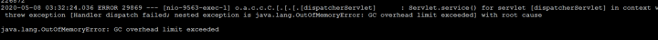

    >   JDK 的 bin 目录下有很多 JVM 性能调优监控工具 jps、jstack、jmap、jhat、jstat、hprof