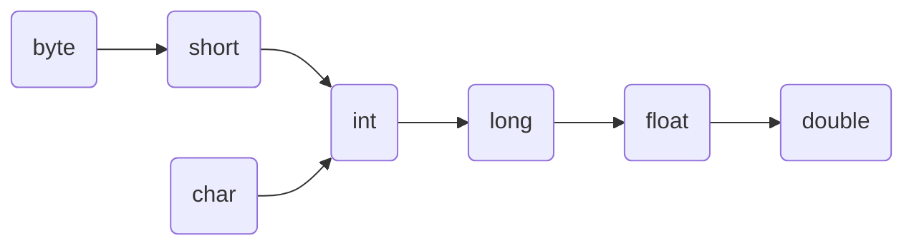

# Java整数常量

---

### 1. Java 整数类型

- byte
- short
- int
- long

### 2. Java 整数常量

int 是最常用的整数类型，因此，大多数情况下，<u><font color =  red>Java 中整数常量默认就是int类型</font></u>。

- 如果将一个较小的整数常量（数值在byte或short的表数范围之内）赋给一个byte或short变量，系统会把这个整数常量当作byte或short类型来处理。
- 如果将一个较大的整数常量（数值在int的表数范围之外）赋值给一个long变量，系统不会把这个整数常量当作long类型来处理，系统把这个整数常量当作int类型来处理，而这个整数常量已经超过了int类型的表数范围，因此系统会提示使用错误。正确的用法是在整数常量后加上 L或l作为后缀，提示系统将整数常量当作long类型来处理。

```java
byte b = 9;// 正确，系统自动把9当作byte类型处理。
short s = 9;// 正确，系统自动把9当作short类型处理。
long l = 999999999999999999;// 错误，系统不会自动把999999999999999999当作long类型处理，而999999999999999999超过了int的表数范围，所以报错！
long l = 999999999999999999L;// 正确
```

- 可以直接将一个较小的整数常量（在int的表数范围内）赋值给long类型的变量，这并不是因为系统自动将整数常量当作long类型来处理，系统依然将这整数常量视为int类型，然后进行类型转换。

### 3. 自动类型转换

如果系统支持把某个基本类型的值直接赋值给另一种基本类型的变量，则这种方式被称作自动类型转换。在Java中，表数范围小的类型可以向表数范围大的类型进行自动类型转换，就比如有大小两杯水，从小杯向大杯倒水，毫无风险，从大杯向小杯倒水，可能溢出。

Java支持的自动类型转换如下（箭头左边的类型可以自动类型转换为右边的类型）：



### 4. 表达式类型的自动提升

当一个算术表达式中包含多个基本类型的值时，整个算术表达式的数据类型将发生自动提升。自动提升的规则如下：

- **byte、short、char类型自动被提升到int类型。**
- **表达式计算结果的类型自动提升到表达式中最高等级的操作数的类型。**

### 5. 经典错误

```java
byte byteNum = 1;
byteNum += 1; //正确
byteNum = byteNum + 1; //错误
byteNum = (byte) (byteNum + 1); //正确

int intNum = 1;
intNum += 1;
intNum = intNum + 1; //正确
```

分析：

1. Java中整数常量为int类型，即表达式 byteNum +1 中的1为 int 类型。
2. 表达式计算结果为int类型：byteNum 为 byte类型，1为int类型，因此表达式计算结果自动提升为int类型。
3. byteNum为byte类型，表格式计算结果为int类型——将高类型的数据赋值给低类型的变量，需要进行强制类型转换。

