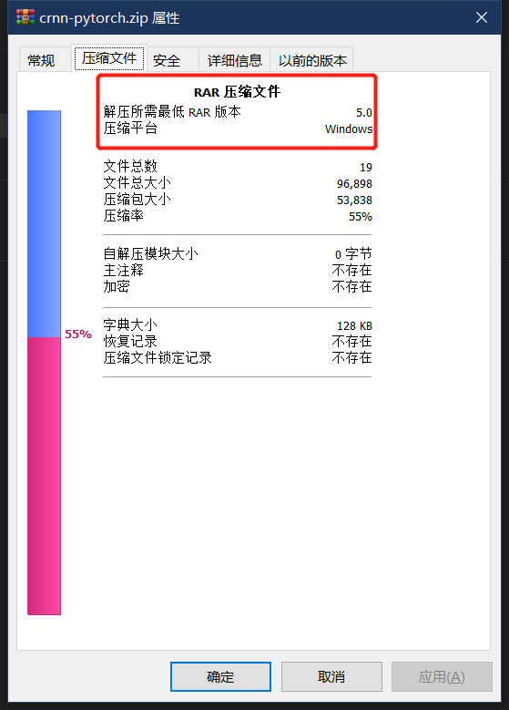
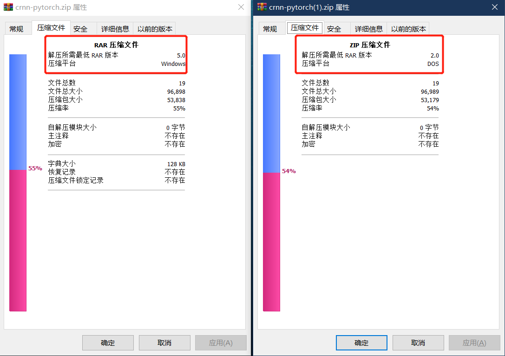

# ZIP解压问题

java.util.zip.ZipException：Archive is not a ZIP archive

系统有一个允许用户通过zip上传数据的功能，昨天有用户在使用时反馈上传的zip没有被系统正常解压，从minio上下载用户上传的zip，在本地调试代码，出现上述异常信息。

信息很明确，系统提示我们我们使用的不是一个zip文件，然而我们使用的确确实实是一个zip文件，使用本地解压工具也能正常解压：

经过漫长、痛苦的排查，最后发现是这个zip文件有问题：

使用本地解压工具创建zip，对比发现用户给的那个zip就是TMD的有问题：

推测：

1.  使用了垃圾压缩工具
2.  用户直接将一个.rar文件修改后缀为.zip