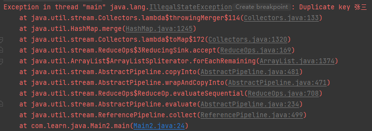

# toMap 流操作 Duplicate key 异常

[TOC]


## 问题复现

问题代码：

```java
package com.learn.java;

import lombok.AllArgsConstructor;
import lombok.Data;
import lombok.NoArgsConstructor;

import java.util.ArrayList;
import java.util.List;
import java.util.Map;
import java.util.stream.Collectors;

/**
 * @author xzy
 * @date 2020-04-06 20:53
 */
public class Main2 {

    public static void main(String[] args) {
        List<Student> studentList = new ArrayList<>(3);
        studentList.add(new Student("111", "张三")); // Look Here
        studentList.add(new Student("111", "李四")); // Look Here
        studentList.add(new Student("112", "王五"));

        Map<String, String> no2nameMap = studentList.stream().collect(Collectors.toMap(Student::getNo, Student::getName)); // Error Code
    }

    @Data
    @NoArgsConstructor
    @AllArgsConstructor
    public static class Student {
        private String no;
        private String name;
    }
}
```

执行结果：




## 问题分析

追踪到 toMap 方法的源码：

```java
public static <T, K, U> Collector<T, ?, Map<K,U>> toMap(
        Function<? super T, ? extends K> keyMapper,
        Function<? super T, ? extends U> valueMapper) {
    return toMap(keyMapper, valueMapper, throwingMerger(), HashMap::new);
}
```

发现底层又调用了一个 toMap 方法，并且额外传入了 `throwingMerger()` 以及 `HashMap::new` 两个参数。先不去管 throwingMerger() 内部的细节，继续往下追踪调用的 toMap 方法的源码：

```java
/**
 * Returns a {@code Collector} that accumulates elements into a
 * {@code Map} whose keys and values are the result of applying the provided
 * mapping functions to the input elements.
 *
 * <p>If the mapped
 * keys contains duplicates (according to {@link Object#equals(Object)}),
 * the value mapping function is applied to each equal element, and the
 * results are merged using the provided merging function.  The {@code Map}
 * is created by a provided supplier function.
 *
 * @implNote
 * The returned {@code Collector} is not concurrent.  For parallel stream
 * pipelines, the {@code combiner} function operates by merging the keys
 * from one map into another, which can be an expensive operation.  If it is
 * not required that results are merged into the {@code Map} in encounter
 * order, using {@link #toConcurrentMap(Function, Function, BinaryOperator, Supplier)}
 * may offer better parallel performance.
 *
 * @param <T> the type of the input elements
 * @param <K> the output type of the key mapping function
 * @param <U> the output type of the value mapping function
 * @param <M> the type of the resulting {@code Map}
 * @param keyMapper a mapping function to produce keys
 * @param valueMapper a mapping function to produce values
 * @param mergeFunction a merge function, used to resolve collisions between
 *                      values associated with the same key, as supplied
 *                      to {@link Map#merge(Object, Object, BiFunction)}
 * @param mapSupplier a function which returns a new, empty {@code Map} into
 *                    which the results will be inserted
 * @return a {@code Collector} which collects elements into a {@code Map}
 * whose keys are the result of applying a key mapping function to the input
 * elements, and whose values are the result of applying a value mapping
 * function to all input elements equal to the key and combining them
 * using the merge function
 *
 * @see #toMap(Function, Function)
 * @see #toMap(Function, Function, BinaryOperator)
 * @see #toConcurrentMap(Function, Function, BinaryOperator, Supplier)
 */
public static <T, K, U, M extends Map<K, U>> Collector<T, ?, M> toMap(
        Function<? super T, ? extends K> keyMapper,
        Function<? super T, ? extends U> valueMapper,
        BinaryOperator<U> mergeFunction,
        Supplier<M> mapSupplier) {
    BiConsumer<M, T> accumulator = (map, element) -> map.merge(keyMapper.apply(element), valueMapper.apply(element), mergeFunction);
    return new CollectorImpl<>(mapSupplier, accumulator, mapMerger(mergeFunction), CH_ID);
}
```

代码没啥好看的，看看方法注解提供了什么信息：

1.   使用提供的映射方法（`keyMapper`、`valueMapper`）将集合中的元素映射为 Map
2.   <u>如果映射的过程中出现了 key 重复的现象，则使用提供的合并方法（`mergeFunction`）进行处理</u>

第二条信息比较关键：上面展示的问题代码中，试图使用 Student 的 no 作为 key，但是恰好存在两条数据的 no 都等于 111，那么最后肯定会调用某个 `mergeFunction` 进行数据合并。定位到上一个 toMap 方法传入的合并方法 —— `throwingMerger()` 的源码：

```java
/**
 * Returns a merge function, suitable for use in
 * {@link Map#merge(Object, Object, BiFunction) Map.merge()} or
 * {@link #toMap(Function, Function, BinaryOperator) toMap()}, which always
 * throws {@code IllegalStateException}.  This can be used to enforce the
 * assumption that the elements being collected are distinct.
 *
 * @param <T> the type of input arguments to the merge function
 * @return a merge function which always throw {@code IllegalStateException}
 */
private static <T> BinaryOperator<T> throwingMerger() {
    return (u,v) -> { throw new IllegalStateException(String.format("Duplicate key %s", u)); };
}
```

发现了问题的根源：**@return a merge function which always throw {@code IllegalStateException}**。

其实也很好理解，使用者的需求千千万万，JDK 根本没法预测使用者到底想怎么合并数据，所以干脆直接抛出异常。


## 问题解决

基于上面的分析，发现解决问题最直接的方式就是<u>自己提供一个合并方法</u>，例如：

```java
public static void main(String[] args) {
    List<Student> studentList = new ArrayList<>(3);
    studentList.add(new Student("111", "张三"));
    studentList.add(new Student("111", "李四"));
    studentList.add(new Student("112", "王五"));

    // Map<String, String> no2nameMap = studentList.stream().collect(Collectors.toMap(Student::getNo, Student::getName));
    Map<String, String> no2nameMap = studentList.stream().collect(Collectors.toMap(Student::getNo, Student::getName, (s, s2) -> s + "," + s2));
}
```