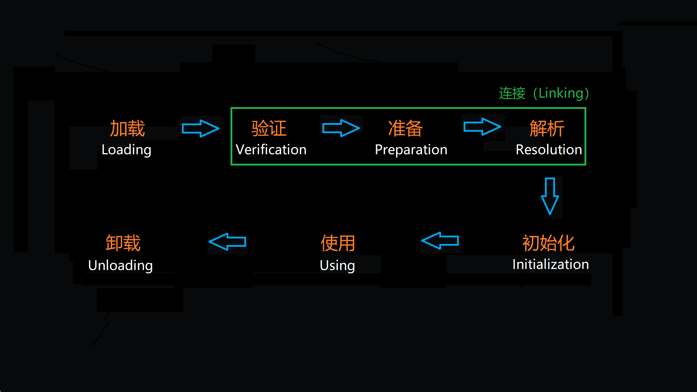

# 局部变量与类变量的赋值与使用
---

## 现象

```java
public class Main {
    // 类变量
    public static int classVariable;

    public static void main(String[] args) {
        // 局部变量
        int localVariables;

        System.out.println(Main.classVariable);//此处正常编译
        System.out.println(localVariables); //此处出现编译错误
    }
}
```

## 本质

<font color = #00BFF>**类变量有两次赋初始值的过程，一次在准备阶段，赋予系统初始值；另一次在初始化阶段，赋予程序员定义的初始值（如果有指定初始值的话）**</font>。因此，即使没有为类变量设置初始值也可以直接使用，类变量至少会在准备阶段被赋予系统初始值。但是局部变量就不一样了，如果一个局部变量定义了但没有赋予初始值是不能使用的，不要认为Java中任何情况下都存在诸如整型变量默认为0，布尔型变量默认为false等这样的默认值。

> Java类经过编译生成对应的字节码文件，JVM想要使用Java类，需要先将类对应的字节码文件加载进JVM的内存空间。类从加载到卸载出JVM内存空间，需要经过以下几个阶段：
>
> 
>


