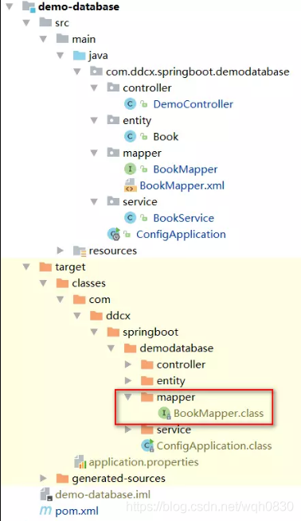
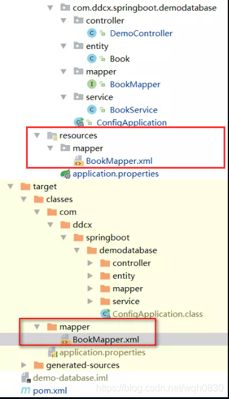

# IDEA不编译src/main/java目录下的xml/properties文件

IDEA的maven项目中，默认源代码目录下（src/main/java目录）的xml等资源文件并不会在编译的时候一块打包进classes文件夹，而是直接舍弃掉。如果使用的是Eclipse，Eclipse的src目录下的xml等资源文件在编译的时候会自动打包进输出到classes文件夹。



对于IDEA的这个问题，有如下的解决办法：

第一种方法：如果没有特殊业务，不需要指定资源文件定位到src/main/java下，则可以在src下创建main/resources目录，并将所需要的xml资源文件放置其中即可。maven工具默认在编译的时候，会将resources文件夹中的资源文件一块打包进classes目录中。




对于MyBatis的这种使用方式，我们必须在配置文件中指定mapper.xml文件的位置，例如在springboot项目中，在application.properties中增加：

```html
mybatis.mapper-locations=classpath:mapper/*.xml
```

如果是普通的ssm项目，则这样配置：

```xml
<bean id="sqlSessionFactoryBean" class="org.mybatis.spring.SqlSessionFactoryBean">
    <property name="dataSource" ref="druidDataSource"/>
    <property name="configLocation" value="classpath:mybatis-config.xml"/>
    <!-- 配置mapper文件的位置 -->
    <property name="mapperLocations" value="classpath:mapper/*.xml"/>
</bean>
```

第二种方法：配置maven的pom文件配置，在pom文件中找到<build>节点，添加下列代码：

```xml
<resources>
    <!-- 表示编译java源码时，包含src/main/java和src/main/resources目录下的xml、properties一起 -->
    <!--如果mapper.xml在src/main/java目录下，就必须做这个配置，不然编译后会丢弃mapper.xml文件-->
    <resource>
        <directory>src/main/java</directory>
        <includes>
            <include>**/*.xml</include>
            <include>**/*.properties</include>
        </includes>
    </resource>
    <resource>
        <directory>src/main/resources</directory>
        <includes>
            <include>**/*.xml</include>
            <include>**/*.properties</include>
        </includes>
    </resource>
</resources>
```

注：以上做法，除了java文件之外，只会包含*.xml和*.properties两种文件，其他文件依然会被丢弃。

如果想包含所有文件，那就用通配符完成：

```xml
<resources>
    <!-- 表示编译java源码时，包含src/main/java和src/main/resources目录下的xml、properties一起 -->
    <!--如果mapper.xml在src/main/java目录下，就必须做这个配置，不然编译后会丢弃mapper.xml文件-->
    <resource>
        <directory>src/main/java</directory>
        <includes>
            <include>**/*.*</include>
        </includes>
    </resource>
    <resource>
        <directory>src/main/resources</directory>
        <includes>
            <include>**/*.*</include>
        </includes>
    </resource>
</resources>
```

