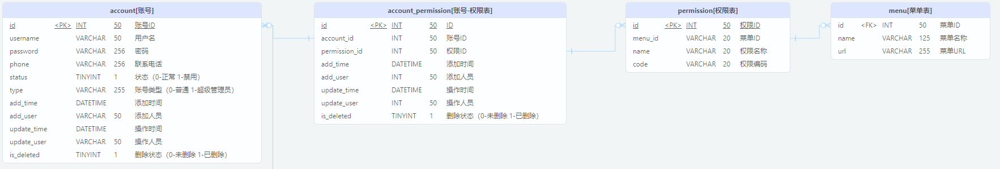

# Myabtis 分页查询问题

## 表结构




## 问题描述

需要以分页查询的方式查询下列格式的数据：

```java
@Data
@NoArgsConstructor
@AllArgsConstructor
public class AccountPageResp implements Serializable {

    private static final long serialVersionUID = 8472483604201010959L;

    /**
     * 账号ID
     */
    private Integer id;

    /**
     * 用户名
     */
    private String username;

    /**
     * 联系电话
     */
    private String phone;

    /**
     * 状态（0-禁用 1-启动）
     */
    private Integer status;

    /**
     * 添加时间
     */
    @JsonFormat(pattern = "yyyy-MM-dd hh:mm:ss")
    private LocalDateTime addTime;

    /**
     * 节点名称
     */
    private String nodeName;

    /**
     * 权限名称
     */
    private List<String> permissionNames;
}
```

XML 文件如下：

```xml
<?xml version="1.0" encoding="UTF-8"?>
<!DOCTYPE mapper PUBLIC "-//mybatis.org//DTD Mapper 3.0//EN" "http://mybatis.org/dtd/mybatis-3-mapper.dtd">
<mapper namespace = "com.shunwang.swy.game.disk.client.side.dao.AccountMapper">
    
    <resultMap id = "account_node_permission" type = "com.shunwang.swy.game.disk.client.side.model.vo.AccountNodePermissionVo">
        <id column = "id" jdbcType = "INTEGER" property = "id"/>
        <result column = "username" jdbcType = "VARCHAR" property = "username"/>
        <result column = "phone" jdbcType = "VARCHAR" property = "phone"/>
        <result column = "status" jdbcType = "INTEGER" property = "status"/>
        <result column = "add_time" jdbcType = "TIMESTAMP" property = "addTime"/>
        <result column = "node_name" jdbcType = "VARCHAR" property = "nodeName"/>
        <collection property = "permissionNames" ofType="string">
            <result column="permission_name" jdbcType="VARCHAR"/>
        </collection>
    </resultMap>
    
    <select id = "findByPage" resultMap = "account_node_permission">
        SELECT
            a.id,
            a.username,
            a.phone,
            a.status,
            a.add_time,
            n.name AS node_name,
            concat(m.name,'-',p.name) AS permission_name
        FROM
            account AS a
                LEFT JOIN account_node an ON a.id = an.account_id AND an.is_deleted != 1
                LEFT JOIN node n ON an.node_id = n.id AND n.is_deleted != 1
                LEFT JOIN account_permission ap ON a.id = ap.account_id AND ap.is_deleted != 1
                LEFT JOIN permission p ON ap.permission_id = p.id
                LEFT JOIN menu m ON p.menu_id = m.id
    </select>
    
</mapper>

```

遇到的问题：有3个账号，每个账号10个权限，当需要以分页查询的形式获取第1页的10条记录时，最终只查询到一个账号的信息。


## 问题分析

Mybatis 对上述 SQL 进行分页查询的大致流程：

1.   根据分页条件设置 `limit`
2.   执行 SQL 获取数据
3.   根据 <collection> 的配置**合并返回值**


已知所有符合条件的记录如下：

```
aaa    p1
aaa    p2
aaa    p3
aaa    p4
aaa    p5
aaa    p6
aaa    p7
aaa    p8
aaa    p9
aaa    p10

bbb    p1
bbb    p2
bbb    p3
bbb    p4
bbb    p5
bbb    p6
bbb    p7
bbb    p8
bbb    p9
bbb    p10

ccc    p1
ccc    p2
ccc    p3
ccc    p4
ccc    p5
ccc    p6
ccc    p7
ccc    p8
ccc    p9
ccc    p10
```

根据上面的分析，Mybatis 会先查出前10条记录，经过合并得到1记录，最终就出现了我们发现的问题。

## 问题解决

先以分页查询的方式查询账号信息，然后查询各个账号的权限信息

-   方案一：在业务层将一个查询拆分成两个

-   方案二：使用 MyBatis 的子查询

    ```xml
    <?xml version="1.0" encoding="UTF-8"?>
    <!DOCTYPE mapper PUBLIC "-//mybatis.org//DTD Mapper 3.0//EN" "http://mybatis.org/dtd/mybatis-3-mapper.dtd">
    <mapper namespace = "com.shunwang.swy.game.disk.client.side.dao.AccountMapper">
        
        <resultMap id = "account_node_permission" type = "com.shunwang.swy.game.disk.client.side.model.vo.AccountNodePermissionVo">
            <id column = "id" jdbcType = "INTEGER" property = "id"/>
            <result column = "username" jdbcType = "VARCHAR" property = "username"/>
            <result column = "phone" jdbcType = "VARCHAR" property = "phone"/>
            <result column = "status" jdbcType = "INTEGER" property = "status"/>
            <result column = "add_time" jdbcType = "TIMESTAMP" property = "addTime"/>
            <result column = "node_name" jdbcType = "VARCHAR" property = "nodeName"/>
            <collection property = "permissionNames" select="selectAccountPermission" column="id" ofType="string">
                <result column="permission_name" jdbcType="VARCHAR"/>
            </collection>
        </resultMap>
        
        <select id = "findByPage" resultMap = "account_node_permission">
            SELECT
                a.id,
                a.username,
                a.phone,
                a.status,
                a.add_time,
                n.name AS node_name
            FROM
                account AS a
                    LEFT JOIN account_node an ON a.id = an.account_id AND an.is_deleted != 1
                    LEFT JOIN node n ON an.node_id = n.id AND n.is_deleted != 1
        </select>
    
        
        <!--SubSelect-->
        
        <select id = "selectAccountPermission" parameterType="integer" resultType="string">
            SELECT
                concat(m.name,'-',p.name) AS permission_name
            FROM
                account_permission AS ap
                    LEFT JOIN permission p ON ap.permission_id = p.id
                    LEFT JOIN menu m ON p.menu_id = m.id
            WHERE
                ap.account_id = #{id} AND ap.is_deleted != 1
        </select>
    </mapper>
    ```