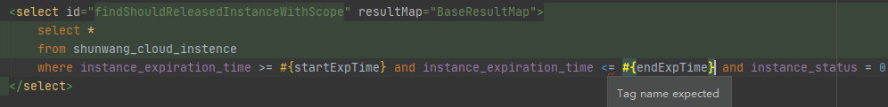
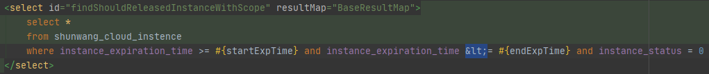
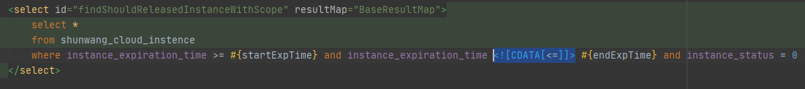

# Tag name expected

---

**问题：**

**原因：**xml 不会自动识别 < 这个符号

**解决：**

1.  方法一：使用转义字符替代

    

    >   Note：
    >   | 转义字符   | 字符  | 说明   |
    >   | ---------- | ---- | ------ |
    >   | &amp; 或 & | &    | 和     |
    >   | &lt; 或 <  | <    | 小于号 |
    >   | &gt; 或 >  | >    | 大于号 |
    >   | &quot;     | "    | 双引号 |
    >   | &nbsp;     |      | 空格   |
    >   | &copy;     | ©    | 版权符 |
    >   | &reg       | ®    | 注册符 |

    

2.  方法二：使用 CDATA

    

    >   Note：所有 XML 文档中的文本均会被解析器解析，<u>但 CDATA 区段（CDATA section）中的文本会被解析器忽略。</u>
    >
    >   https://www.w3school.com.cn/xml/xml_cdata.asp

