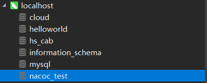

### 异常：No DataSource set

---

环境：Win10 + Docker


描述：

1.   使用docker搭建局域网
2.   启动 Nacos 和 MySQl 容器，并加入局域网
3.   修改 Nacos 配置文件，使得 Nacos 将信息存储到 MySQL
4.   重启 Nacos 时报错


异常信息：

```
Caused by: com.alibaba.nacos.api.exception.NacosException: Nacos Server did not start because dumpservice bean construction failure :
No DataSource set
        at com.alibaba.nacos.config.server.service.dump.DumpService.dumpOperate(DumpService.java:236)
        at com.alibaba.nacos.config.server.service.dump.ExternalDumpService.init(ExternalDumpService.java:52)
        at sun.reflect.NativeMethodAccessorImpl.invoke0(Native Method)
        at sun.reflect.NativeMethodAccessorImpl.invoke(NativeMethodAccessorImpl.java:62)
        at sun.reflect.DelegatingMethodAccessorImpl.invoke(DelegatingMethodAccessorImpl.java:43)
        at java.lang.reflect.Method.invoke(Method.java:498)
        at org.springframework.beans.factory.annotation.InitDestroyAnnotationBeanPostProcessor$LifecycleElement.invoke(InitDestroyAnnotationBeanPostProcessor.java:363)
        at org.springframework.beans.factory.annotation.InitDestroyAnnotationBeanPostProcessor$LifecycleMetadata.invokeInitMethods(InitDestroyAnnotationBeanPostProcessor.java:307)
        at org.springframework.beans.factory.annotation.InitDestroyAnnotationBeanPostProcessor.postProcessBeforeInitialization(InitDestroyAnnotationBeanPostProcessor.java:136)
        ... 53 common frames omitted
Caused by: java.lang.IllegalStateException: No DataSource set
        at org.springframework.util.Assert.state(Assert.java:73)
        at org.springframework.jdbc.support.JdbcAccessor.obtainDataSource(JdbcAccessor.java:77)
        at org.springframework.jdbc.core.JdbcTemplate.execute(JdbcTemplate.java:371)
        at org.springframework.jdbc.core.JdbcTemplate.query(JdbcTemplate.java:452)
        at org.springframework.jdbc.core.JdbcTemplate.query(JdbcTemplate.java:462)
        at org.springframework.jdbc.core.JdbcTemplate.queryForObject(JdbcTemplate.java:473)
        at org.springframework.jdbc.core.JdbcTemplate.queryForObject(JdbcTemplate.java:480)
        at com.alibaba.nacos.config.server.service.repository.extrnal.ExternalStoragePersistServiceImpl.findConfigMaxId(ExternalStoragePersistServiceImpl.java:658)
        at com.alibaba.nacos.config.server.service.dump.processor.DumpAllProcessor.process(DumpAllProcessor.java:51)
        at com.alibaba.nacos.config.server.service.dump.DumpService.dumpConfigInfo(DumpService.java:293)
        at com.alibaba.nacos.config.server.service.dump.DumpService.dumpOperate(DumpService.java:205)
        ... 61 common frames omitted
```


尝试过的排查方向：

1.   数据库URL没有加上serverTimezone

     排查结果：加上以后还是无法启动

2.   MySQL 没有启动远程连接

     排查结果：远程连接已经开启

3.   网络问题导致连接超时

     排查结果：加长连接超时时间，但还是无法启动  


最后是如何解决的：

1.   修改配置文件，配置 logging.level.root=info

2.   启动服务

3.   查看控制台打印的信息

     ```
     2022-01-26 15:55:44,663 ERROR Nacos failed to start, please see /home/nacos/logs/nacos.log for more details.
     ```

4.   根据提示找到日志文件

     ```
     java.sql.SQLNonTransientConnectionException: Could not create connection to database server. Attempted reconnect 3 times. Giving up.
         ...
     Caused by: com.mysql.cj.exceptions.CJException: Unknown database 'nacos_test'
     ```

     emmmm，打开数据库：

     

     emmm，nacoc………..又被自己坑惨了…………….