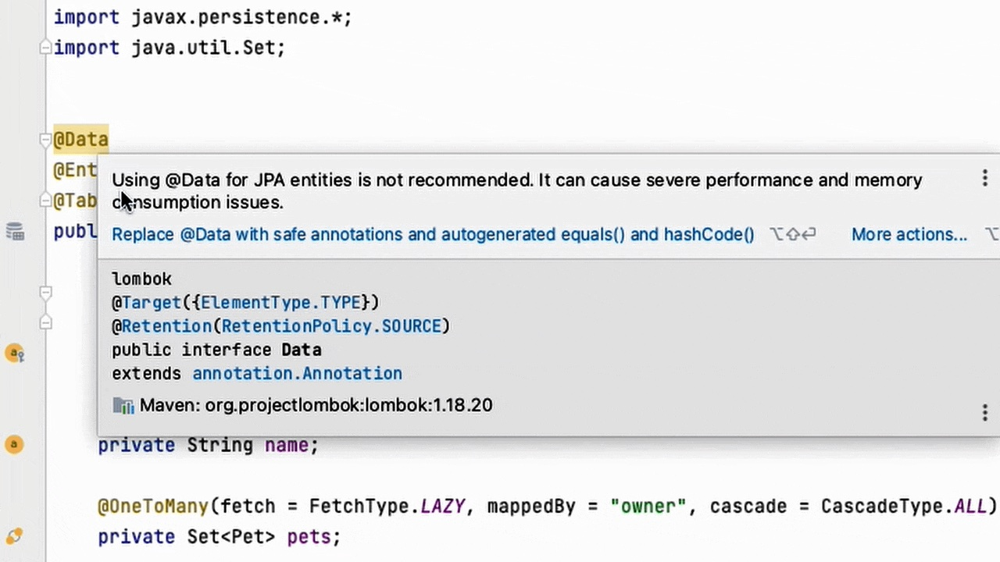
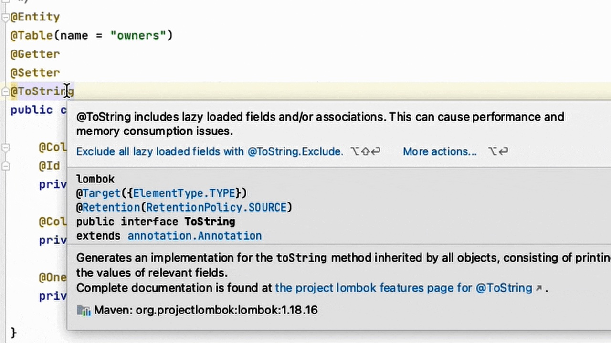
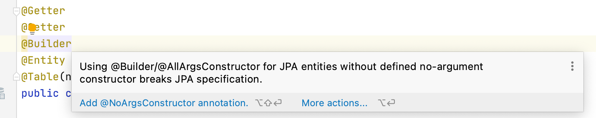

# Lombok and JPA: What Could Go Wrong?

**Mixing great things always results in something great – this law  works almost everywhere, but not in cooking or coding. In this article,  we will have a look at how Lombok can break your JPA project.**

>   原文地址：https://dzone.com/articles/lombok-and-jpa-what-may-go-wrong

---

Lombok is a great tool that makes your Java code concise and clean.  However, there are a few things to consider when using it with JPA. In  this article, we’ll look at how the misuse of Lombok can hurt the  performance of JPA applications or even crash them, and how to avoid  that but still gain the benefits of using Lombok.

We develop [JPA Buddy](https://plugins.jetbrains.com/plugin/15075-jpa-buddy) – a plugin for IntelliJ IDEA designed to make the use of JPA easier.  Before writing a single line of code for it, we went through a ton of  projects on GitHub to understand how people work with JPA. Turns out, a  lot of them use Lombok for their entities.


It is absolutely fine to use Lombok in your JPA projects, but it has  some caveats. Analyzing the projects, we see people stumble into the  same pitfalls over and over again. This is why we introduced a number of code inspections for Lombok to JPA Buddy. This article shows the most  common issues you may face using Lombok with JPA entities.

## Broken HashSets (and HashMaps)

Entity classes often get annotated with `@EqualsAndHashCode` or `@Data`. The documentation of `@EqualsAndHashCode` states:

>   By default, it'll use all non-static, non-transient fields, but you can  modify which fields are used (and even specify that the output of  various methods is to be used) by marking type members with `@EqualsAndHashCode.Include` or `@EqualsAndHashCode.Exclude`.

Equals()/hashCode() implementation for JPA entities is a sensitive  subject. Naturally, entities are mutable. Even the id of an entity is  often generated by a database, so it gets changed after the entity is  first persisted. This means there are no fields we can rely on to  calculate the hashCode.

For example, let’s create a test entity:

```java
@Entity
@EqualsAndHashCode
public class TestEntity {

   @Id
   @GeneratedValue(strategy = GenerationType.IDENTITY)
   @Column(nullable = false)
   private Long id;
    
}
```

And execute the following code:

```java
TestEntity testEntity = new TestEntity();
Set<TestEntity> set = new HashSet<>();
set.add(testEntity);
testEntityRepository.save(testEntity);
Assert.isTrue(set.contains(testEntity), "Entity not found in the set");
```

The assertion in the last line fails, even though the entity is added to the set just a couple of lines above. Delomboking the `@EqualsAndHashCode` gives us the following:

```java
public int hashCode() {
   final int PRIME = 59;
   int result = 1;
   final Object $id = this.getId();
   result = result * PRIME + ($id == null ? 43 : $id.hashCode());
   return result;
}
```

Once the id is generated (on its first save) the hashCode gets changed.  So the HashSet looks for the entity in a different bucket and cannot  find it. It wouldn’t be an issue if the id was set during the entity  object creation (e.g. was a UUID set by the app), but DB-generated ids  are more common.

## Accidentally Loading Lazy Attributes

As mentioned above, `@EqualsAndHashCode` includes all the object fields by default. The same is right for `@ToString`:

>   Any class definition may be annotated with @ToString to let lombok  generate an implementation of the toString()method. By default, it'll  print your class name, along with each field, in order, separated by  commas.

These methods call equals()/hashCode()/toString() *on every field* of an object. This can have an unwanted side-effect for JPA entities: accidentally loading lazy attributes.

For example, calling `hashCode()` on a lazy `@OneToMany` may fetch all the entities it contains. This can easily harm the  application performance. It can also lead to a  LazyInitializationException if it happens outside a transaction.

We believe `@EqualsAndHashCode` and `@Data` should not be used for entities at all, so JPA Buddy alerts developers:



`@ToString` can still be used, but all the lazy fields need to be excluded. This can be achieved by placing `@ToString.Exclude` on the desired fields, or by using `@ToString(onlyExplicitlyIncluded = true`) on the class and `@ToString.Include` on non-lazy fields. JPA Buddy has a special action for it:



## Missing No-Argument Constructor

According to the JPA specification, all entity classes are required to have a public or protected no-argument constructor. Obviously, when `@AllArgsConstructor` is used the compiler does not generate the default constructor, the same is true for `@Builder`:

>   Applying `@Builder` to a class is as if you added `@AllArgsConstructor(access = AccessLevel.PACKAGE)` to the class and applied the `@Builder` annotation to this all-args-constructor.

So make sure to always use them with `@NoArgsConstructor` or an explicit no-argument constructor:



## Conclusion

Lombok makes your code look nicer, but as with any magic-like tool, it is important to understand how exactly it works and when to use it.  You can also rely on development tools to predict potential issues for  you. Otherwise, you might accidentally hurt the performance of your  application or even break something.

When working with JPA and Lombok, remember these rules:

-   Avoid using `@EqualsAndHashCode` and `@Data` with JPA entities;
-   Always exclude lazy attributes when using `@ToString`;
-   Don’t forget to add `@NoArgsConstructor` to entities with `@Builder` or `@AllArgsConstructor`.