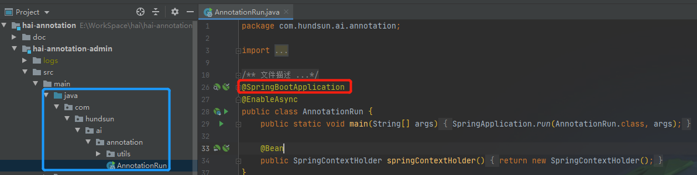
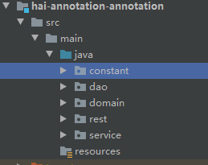
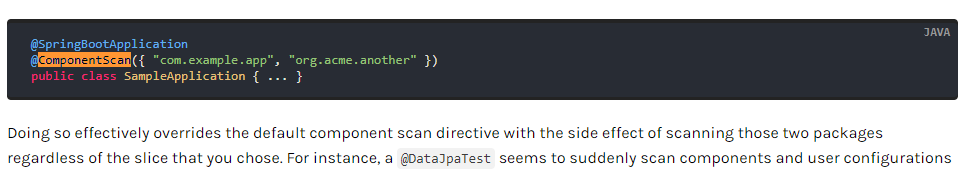

# Spring Boot 目录结构与组件扫描

---

入口模块的目录结构：

问题模块的目录结构：

问题描述：annotation模块的组件无法创建

**问题探究：**@SpringBootApplication=@Configuration+@EnableAutoConfiguration+@ComponentScan，其中扫描包的范围为启动类所在包和子包，不包括第三方的jar包。如果我们需要扫描通过maven依赖添加的jar，我们就要单独使用@ComponentScan注解扫描第三方包。

但是，如果@SpringBootApplication和@ComponentScan注解共存，那么@SpringBootApplication注解的扫描的作用将会失效，也就是说不能够扫描启动类所在包以及子包了。因此，我们必须在@ComponentScan注解配置本工程需要扫描的包范围。引用官网的说明：

