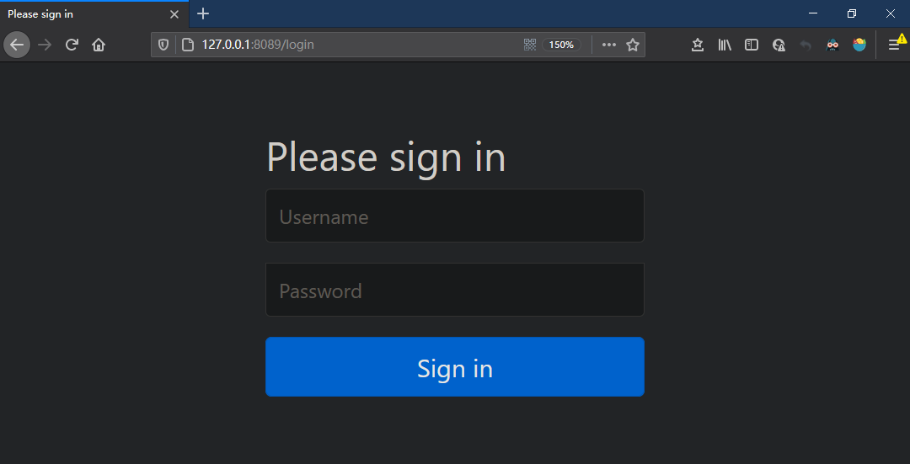

# Spring MVC Unauthorized问题

**接口源码：**

```java
@RestController
@RequestMapping("user/")
@Api(tags = "用户管理")
public class UserController {

    private final UserService userService;

    @Autowired
    public UserController(UserService userService) {
        this.userService = userService;
    }

    @PostMapping("login")
    @ApiOperation("用户登陆")
    public Message login(@RequestBody UserEntity loginUser) {
        return userService.login(loginUser);
    }
}
```

**使用postman访问接口，得到的信息：**

```json
{
    "timestamp": "2020-12-14 02:00:55",
    "status": 401,
    "error": "Unauthorized",
    "message": "Unauthorized",
    "path": "/user/test_token"
}
```

**使用浏览器访问接口，自动跳转到的页面：**



**问题排查：**

```xml
<dependency>
    <groupId>org.springframework.boot</groupId>
    <artifactId>spring-boot-starter-security</artifactId>
</dependency>
```

<font color = red>系统使用了Spring Security，而Spring Security默认对所有路径进行权限认证，并且提供默认的登陆页面。</font>如果系统最终没有使用到Spring Security，将该依赖移除即可解决问题；如果系统确实需要使用Spring Security，那么可以自定义路径鉴权方式：

```java
@Configuration
@EnableWebSecurity
@EnableGlobalMethodSecurity(prePostEnabled = true, securedEnabled = true)
public class WebSecurityConfig extends WebSecurityConfigurerAdapter {
    @Override
    protected void configure(HttpSecurity httpSecurity) throws Exception {
        httpSecurity.authorizeRequest()              
            // 直接放行
            .antMatchers("/auth/**", "/error/**", "/dev/**").permitAll()
            // 权限认证
            .anyRequest().authenticated();
    }
}
```

**Spring Security默认的configure(HttpSecurity httpSecurity)实际上等同于如下配置：**

```java
    @Override
    protected void configure(HttpSecurity httpSecurity) throws Exception {
        httpSecurity.authorizeRequest()
            // 对所有http请求进行权限认证
            .anyRequest().authenticated().and()
            // 支持基于表单的登陆
            .formLogin().and()
            // 支持基于Basic方式的认证
            .httpBasic();
    }
```

同时，由于没有重载configure(AuthenticationManagerBuilder)，所有系统没有用户存储支撑认证过程，所以系统相当于没有用户，所以没有人可以认证成功。

