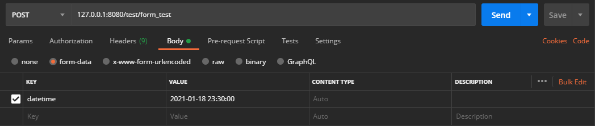
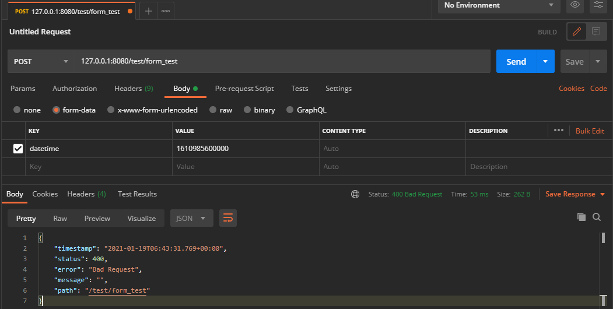
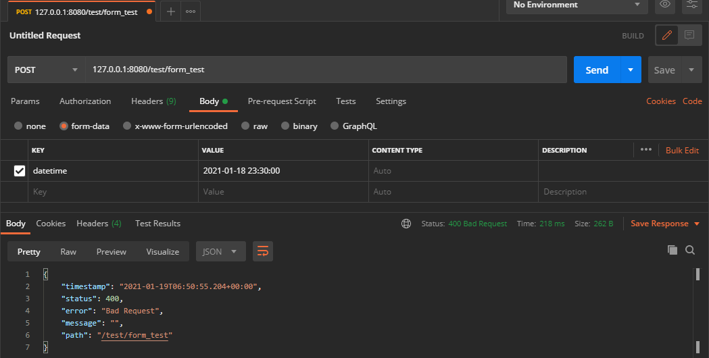

# Spring MVC form-date 日期传输问题

[toc]

## 方法总结

SpringMVC接收form-date中的日期数据时，系统抛出了格式转换异常，解决方式有如下几种：

### 1. @DateTimeFormat注解 + 字符串

后端使用@DateTimeFormat注解标注Date字段，form-date使用字符串发送日期。

```java
public class FormDataDTO {
    @DateTimeFormat(pattern = "yyyy-MM-dd HH:mm:ss")
    private Date datetime;
}
```



### 2. @InitBinder

```java
@RestController
@RequestMapping("test/")
public class TestController {
    @PostMapping("form_test")
    public Message formDateTest1(FormDataDTO fd) {
        return MessageBox.ok(fd);
    }
    
    @InitBinder
    public void initBinder(WebDataBinder binder) {
        //转换日期格式
        DateFormat dateFormat = new SimpleDateFormat("yyyy-MM-dd HH:mm:ss");
        //注册自定义的编辑器
        binder.registerCustomEditor(Date.class, new CustomDateEditor(dateFormat, true));
    }
}
```

### 3. 全局类型转换器

不推荐使用，容易出错。


## 问题重现

接收数据的实体类：

```java
import lombok.AllArgsConstructor;
import lombok.Data;
import lombok.NoArgsConstructor;
import org.springframework.format.annotation.DateTimeFormat;

import java.util.Date;

@Data
@NoArgsConstructor
@AllArgsConstructor
public class FormDataDTO {
    private Date datetime;
}
```

接口form-date数据的接口：

```java
@RestController
@RequestMapping("test/")
public class TestController {
    @PostMapping("form_test")
    public Message formDateTest1(FormDataDTO fd) {
        return MessageBox.ok(fd);
    }
}
```

### 接口测试1：发送时间戳



后端打印的错误信息：

2021-01-19 14:43:31.759  WARN 2964 --- [nio-8080-exec-3] .w.s.m.s.DefaultHandlerExceptionResolver : Resolved [org.springframework.validation.BindException: org.springframework.validation.BeanPropertyBindingResult: 1 errors Field error in object 'formDataDTO' on field 'datetime': rejected value [1610985600000]; codes [typeMismatch.formDataDTO.datetime,typeMismatch.datetime,typeMismatch.java.util.Date,typeMismatch]; arguments [org.springframework.context.support.DefaultMessageSourceResolvable: codes [formDataDTO.datetime,datetime]; arguments []; default message [datetime]]; default message [Failed to convert property value of type 'java.lang.String' to required type 'java.util.Date' for property 'datetime'; nested exception is org.springframework.core.convert.ConversionFailedException: <font color = red>Failed to convert from type [java.lang.String] to type [@org.springframework.format.annotation.DateTimeFormat java.util.Date] for value '1610985600000'; nested exception is java.lang.IllegalArgumentException: Parse attempt failed for value [1610985600000]]]</font>


### 接口测试2：发送字符串



后端打印的错误信息：

2021-01-19 14:50:55.197  WARN 3040 --- [nio-8080-exec-1] .w.s.m.s.DefaultHandlerExceptionResolver : Resolved [org.springframework.validation.BindException: org.springframework.validation.BeanPropertyBindingResult: 1 errors
Field error in object 'formDataDTO' on field 'datetime': rejected value [2021-01-18 23:30:00]; codes [typeMismatch.formDataDTO.datetime,typeMismatch.datetime,typeMismatch.java.util.Date,typeMismatch]; arguments [org.springframework.context.support.DefaultMessageSourceResolvable: codes [formDataDTO.datetime,datetime]; arguments []; default message [datetime]]; default message [Failed to convert property value of type 'java.lang.String' to required type 'java.util.Date' for property 'datetime'; nested exception is org.springframework.core.convert.ConversionFailedException:<font color = red> Failed to convert from type [java.lang.String] to type [java.util.Date] for value '2021-01-18 23:30:00'; nested exception is java.lang.IllegalArgumentException]]</font>