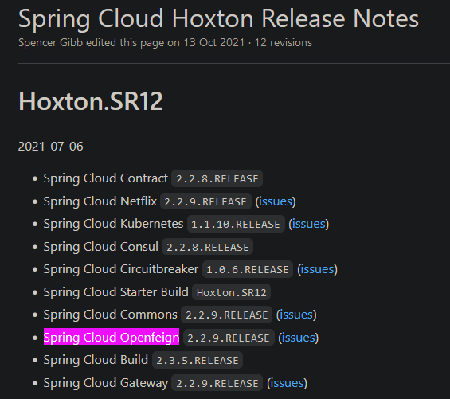

# @FeignClient fallback 不生效

1.   网上的解决方案基本是让我们配置 feign.hystrix.enabled=true

2.   但是我配置了以后 fallback 还是没有生效

3.   最后发现是我配置的OpenFeign版本有问题……

     我的配置：

     ```xml
     <!--spring cloud-->
     <dependency>
         <groupId>org.springframework.cloud</groupId>
         <artifactId>spring-cloud-dependencies</artifactId>
         <version>Hoxton.RELEASE</version>
         <type>pom</type>
         <scope>import</scope>
     </dependency>
     
     <!--openFeign-->
     <dependency>
         <groupId>org.springframework.cloud</groupId>
         <artifactId>spring-cloud-starter-openfeign</artifactId>
         <version>3.1.0</version>
     </dependency>
     ```

     官方的要求：https://github.com/spring-cloud/spring-cloud-release/wiki/Spring-Cloud-Hoxton-Release-Notes

     

     将Openfeign的版本修改为2.2.9.RELEASE以后，fallback马上就生效了……

4.   真是自己把自己坑死了，以后再也不敢瞎配版本了！

