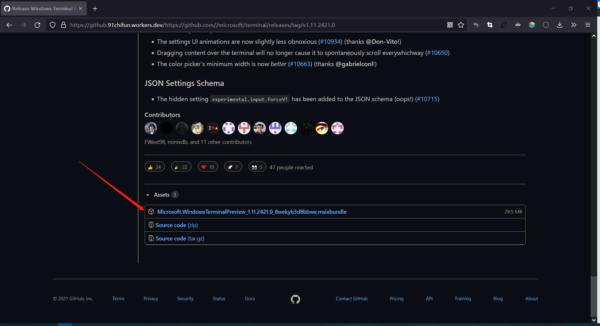

# Win10 安装 Windows Terminal

---


## 方案1：Microsoft Store 搜索、安装


## 方案2：Github下载安装

1.   选择合适的版本下载

     https://github.com/microsoft/terminal/tags

     

     

2.   安装 WindowTerminal

     .msixbundle 文件下载完成后，使用 PowerShell 进入目录，执行以下命令安装 Windows Terminal：

     ```
     Add-AppxPackage ./xxx.msixbundle
     ```

     

     

