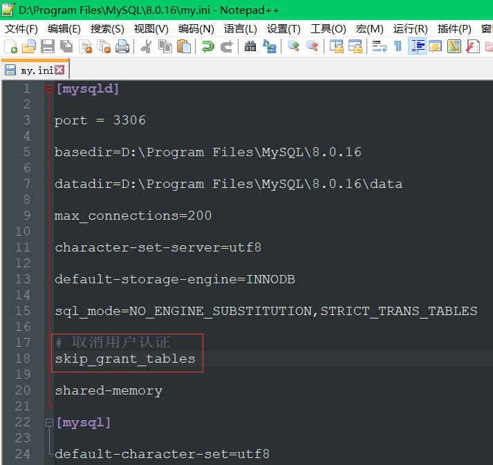
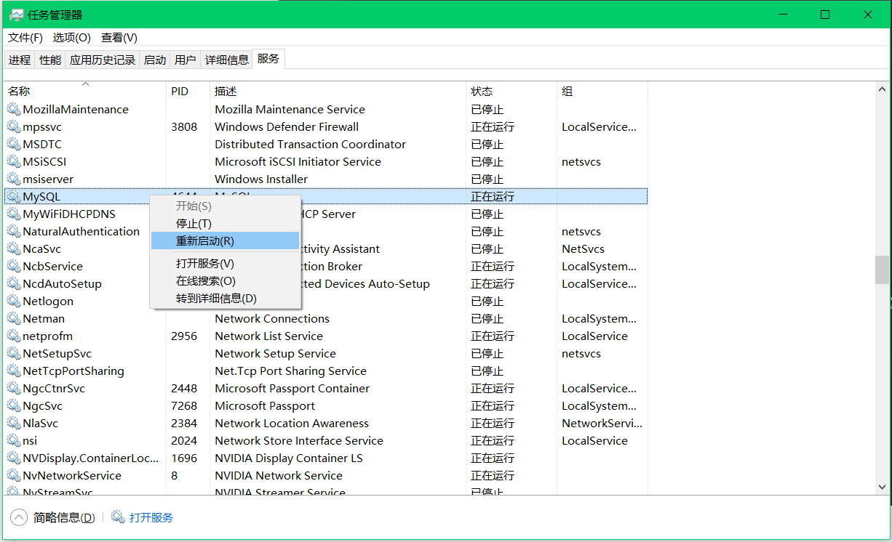
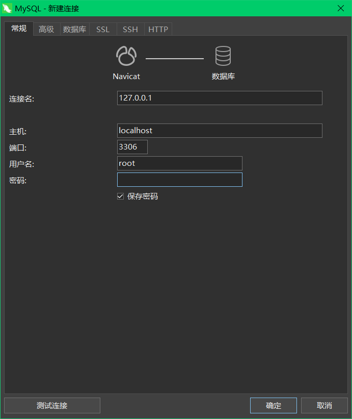
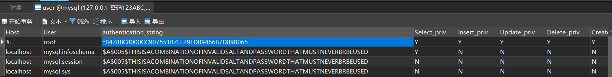

# MySQL8重置密码

---

1. 关闭MySQL用户校验

    在my.ini文件中添加语句：skip_grant_tables

    

2. 重启MySQL服务

    

3. 进入数据库

    由于用户校验已经被关闭，输入任意密码即可进入数据库：

    

4. 清除原密码

    

    打开user表可以发现root账号<font color = red>**加密后的**</font>密码（特意强调这里的密码是加密后的密码，所以不要高兴的太早），请求密码：

    update user set authentication_string = ‘’ where user.User = ‘root’

5. 重新启动MySQL用户校验，重启MySQL，使用‘’密码登录root账号。

    

6. 重置密码

    ```sql
    update user set Host='%' where User='root';
    ALTER USER 'root'@'%' IDENTIFIED WITH mysql_native_password BY 'password'; # password换成你的密码
    ```

    

