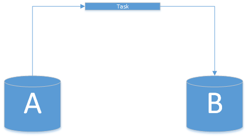
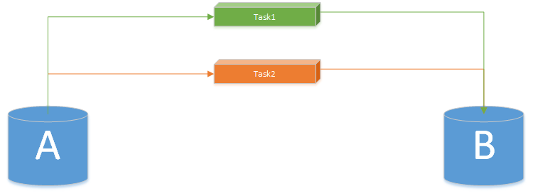

# 分布式系统 & 定时任务

[toc]


##### （1）描述



有一个5分钟执行一次的定时任务负责从 A 库移动数据到 B 库：

```pseudocode
@Scheduled(cron = "0 0/5 * * * ?")
public void transferBooks() {
    // 从A库获取数据
    List<Book> bookList = getBooksFromA();
    if(isNotEmpty(bookList)) {
        setBooksToB(bookList); // 向B库添加数据
    }
}
```


##### （2）分析

在分布式系统中，处理定时任务的服务不可能只有一个实例，因此可能出现并发问题：



>   Note：如果恰好有 2 个实例同事指定定时任务，同时从 A 库获取数据，同时向 B 库添加数据，最终被添加到 B 库的数据就会重复。


##### （3）解决

添加分布式锁即可解决问题：

```pseudocode
@Scheduled(cron = "0 0/5 * * * ?")
public void transferBooks() {
    
    // 分布式锁
    if (!systemCacheService.tryLock("lock_key_transfer_books", 3, TimeUnit.MINUTES)) {
        return;
    }
    
    // 从A库获取数据
    List<Book> bookList = getBooksFromA();
    if(isNotEmpty(bookList)) {
        setBooksToB(bookList); // 向B库添加数据
    }
}
```

